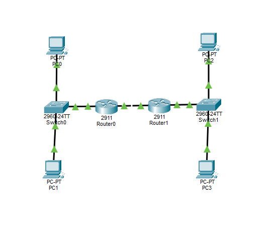
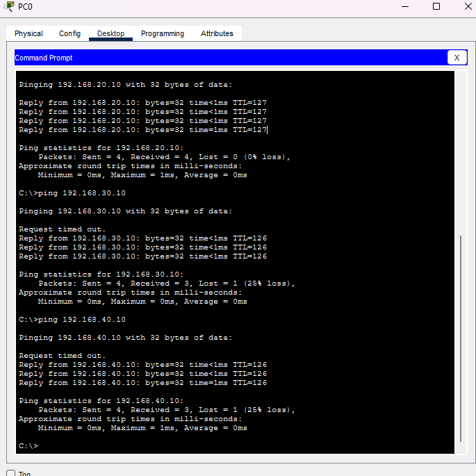

# Network Configuration Lab

A hands-on Cisco Packet Tracer lab demonstrating fundamental network configuration, routing, switching, VLAN segmentation, and network troubleshooting.

## Network Topology

The lab consists of:

- 2 Cisco 2911 Routers
- 2 Cisco 2960 Switches
- 4 PCs
- 4 VLANs
- OSPF routing between routers

## Network Design

| Device | Network / VLAN | IP Address | Default Gateway |
|---|---|---|---|
| PC0 | VLAN 10 | 192.168.10.10/24 | 192.168.10.1 |
| PC1 | VLAN 20 | 192.168.20.10/24 | 192.168.20.1 |
| PC2 | VLAN 30 | 192.168.30.10/24 | 192.168.30.1 |
| PC3 | VLAN 40 | 192.168.40.10/24 | 192.168.40.1 |
| Router0 | Router Link | 10.0.12.1/30 | - |
| Router1 | Router Link | 10.0.12.2/30 | - |

## VLAN Configuration

- VLAN 10 - PC0 Network
- VLAN 20 - PC1 Network
- VLAN 30 - PC2 Network
- VLAN 40 - PC3 Network

Router-on-a-Stick is used for inter-VLAN routing between the VLANs and their respective routers.

## Routing

OSPF is configured between Router0 and Router1 using Area 0.

### Router0 Advertised Networks

- `192.168.10.0/24`
- `192.168.20.0/24`
- `10.0.12.0/30`

### Router1 Advertised Networks

- `192.168.30.0/24`
- `192.168.40.0/24`
- `10.0.12.0/30`

The OSPF adjacency between Router0 and Router1 successfully reaches the `FULL` state.

## Technologies & Concepts

- Cisco Packet Tracer
- TCP/IP
- IPv4 Subnetting
- VLAN
- Access Ports
- IEEE 802.1Q Trunking
- Router-on-a-Stick
- Inter-VLAN Routing
- OSPF
- Routing & Switching
- Network Troubleshooting

## Connectivity Test

End-to-end connectivity was tested between different VLANs and routed networks.

PC0 (`192.168.10.10`) successfully communicated with:

- PC1 - `192.168.20.10`
- PC2 - `192.168.30.10`
- PC3 - `192.168.40.10`

This confirms successful VLAN configuration, inter-VLAN routing, and OSPF routing between both routers.

## Packet Tracer File

The complete Cisco Packet Tracer lab is available in:

`network-configuration-lab.pkt`

## Learning Outcomes

This lab demonstrates practical understanding of:

- VLAN creation and segmentation
- Access port configuration
- 802.1Q trunk configuration
- Router-on-a-Stick
- IPv4 addressing and subnetting
- Inter-VLAN routing
- OSPF configuration and neighbor establishment
- Routing between multiple networks
- End-to-end connectivity testing
- Basic network troubleshooting
